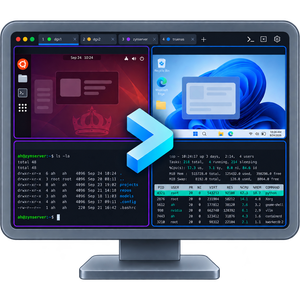
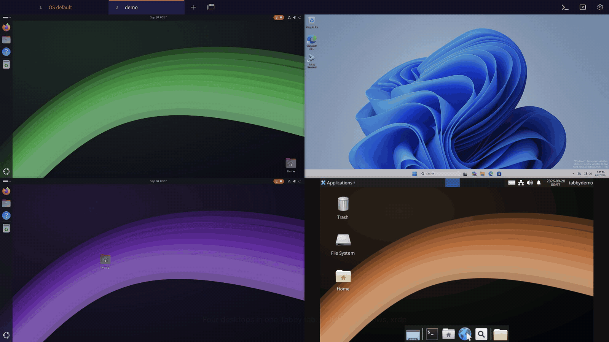
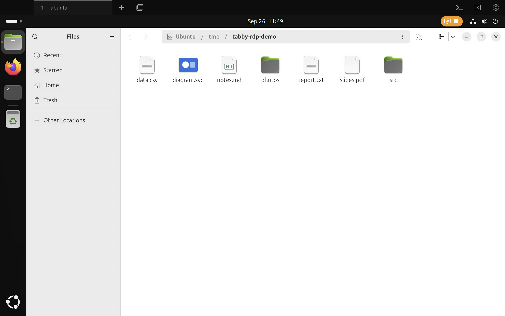
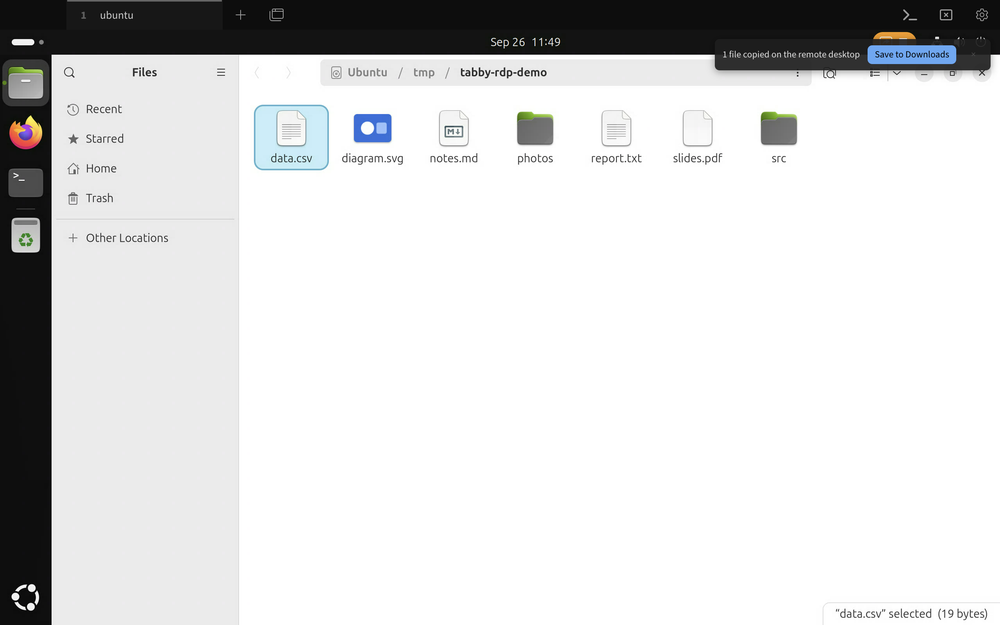
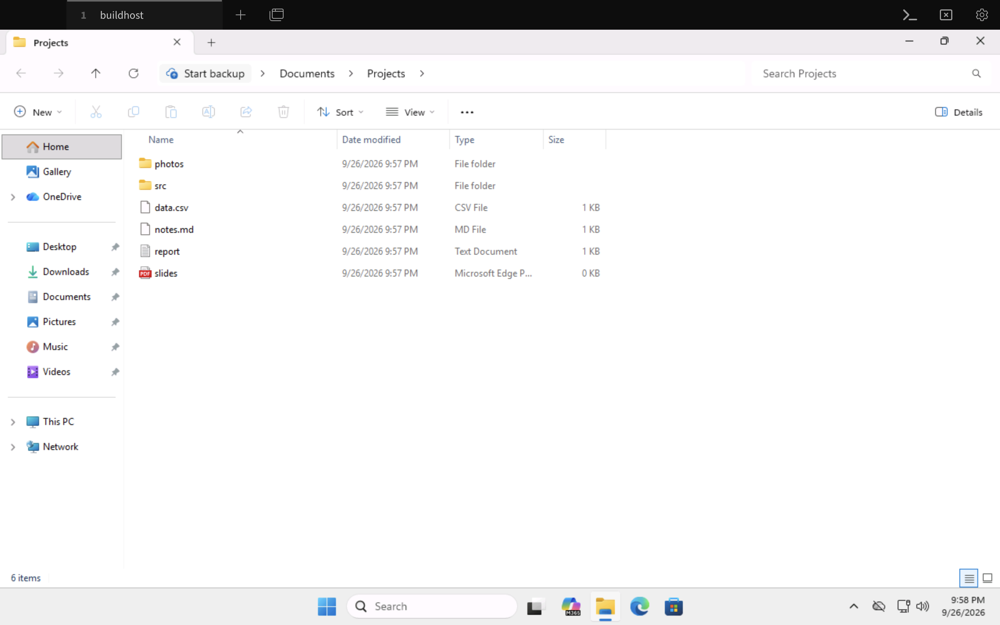
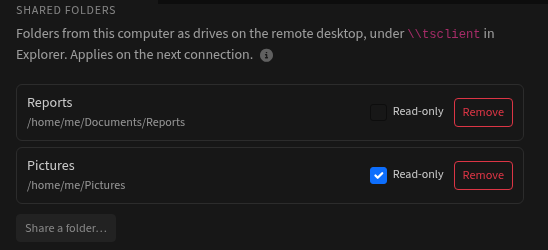
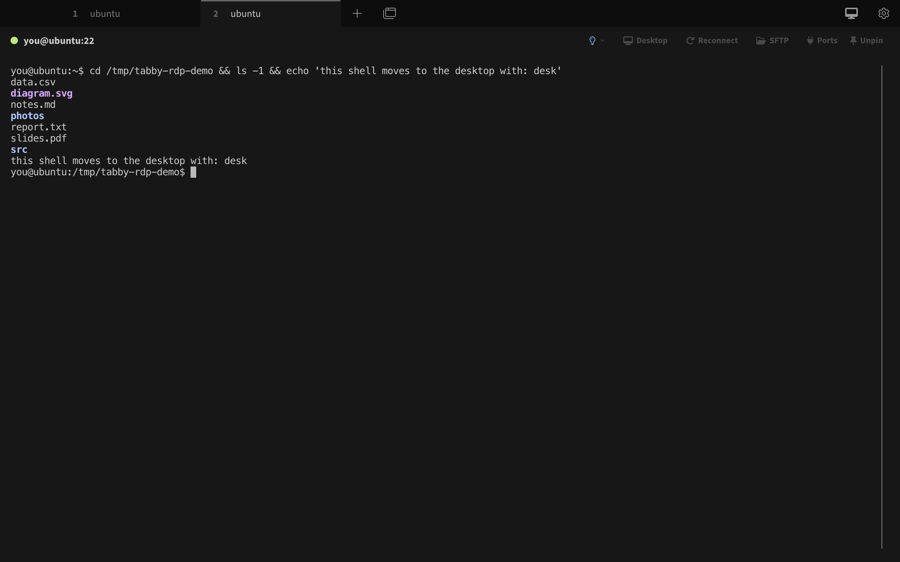
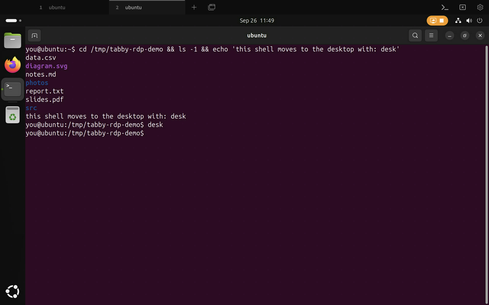

<div align="center">



# tabby-rdp

**Remote desktops in your Tabby SSH tabs.**<br>
Linux and Windows, side by side, through the SSH connections you already have.

[](https://www.npmjs.com/package/tabby-rdp)
[](LICENSE)
[](https://tabby.sh)



<sub>Sharper: <a href="https://github.com/meanaverage/tabby-rdp/releases/download/v0.3.0/tabby-rdp-demo.mp4">the same demo as an MP4</a> (downloads)</sub>

</div>

---

tabby-rdp is a plugin for the [Tabby](https://tabby.sh) terminal. Press a key in an SSH tab and the machine's desktop
appears in its place; press it again and you're back at the shell. Everything travels inside the SSH connection:
nothing is opened on the network, and nothing has to be installed on the remote machine beforehand.

- **Linux desktops without a monitor or a login.** The plugin starts a headless GNOME session for your SSH user with
  GNOME Remote Desktop, on the fly, without root. A server in a rack works as well as a workstation.
- **Other Linux desktops** (KDE, XFCE, MATE, Cinnamon, …) through xrdp, where it runs: the plugin finds it by itself.
- **Windows desktops** behind any SSH host, such as a VM on your build server, and the desktop of a Windows machine
  you SSH into.
- **Remote desktop profiles** for machines you reach without SSH (LAN, VPN): in Tabby's profile list, in a tab of their
  own.
- **Several machines at once:** split a tab into a grid of desktops, then paste to all of them or type into all of them
  at once. A short on-screen name says which one you're in.
- **VMs found for you:** the libvirt VMs on an SSH host that have a desktop show up in its menu, ready to open, or to
  start and open.
- **`ssh` on from a host:** in an SSH tab where you typed `ssh` to another machine, the desktop is that machine's.
- **A proper desktop experience:** clipboard and files both ways, sound and microphone, live resize to the pane,
  sharp Retina rendering, Mac keyboard shortcuts, and automatic reconnects after sleep.
- **`desk`:** type `desk` in the console and the same shell, with its history and running programs, moves into a
  terminal on the desktop.

Everything is in **Settings › Remote Desktop**, in tabs: getting started and the shortcuts, the settings, the name
overlay, the desktops and certificates the plugin keeps, saved accounts, and troubleshooting.

The remote desktop itself is [IronRDP](https://github.com/Devolutions/IronRDP)'s web client, running inside Tabby.
Making it work with GNOME took fixes in IronRDP, which we contribute upstream ([below](#built-on-ironrdp)).

## Contents

- [Install](#install)
- [Use](#use)
- [Features](#features)
- [Windows and other desktops behind a host](#windows-and-other-desktops-behind-a-host)
- [Remote desktop profiles](#remote-desktop-profiles)
- [Saved accounts](#saved-accounts)
- [Clipboard](#clipboard)
- [Shared folders](#shared-folders)
- [Several desktops in one tab](#several-desktops-in-one-tab)
- [VMs on a host](#vms-on-a-host)
- [desk: the console on the desktop](#desk-the-console-on-the-desktop)
- [Settings](#settings)
- [Requirements](#requirements)
- [Built on IronRDP](#built-on-ironrdp)
- [Development](#development)
- [Limitations](#limitations)
- [Questions and problems](#questions-and-problems)
- [License](#license)

## Install

In Tabby: **Settings › Plugins**, search for **tabby-rdp**, install, and restart Tabby.

Or from a terminal, into Tabby's plugin folder (on macOS `~/Library/Application Support/tabby/plugins`, on Linux
`~/.config/tabby/plugins`, on Windows `%APPDATA%\tabby\plugins`):

```sh
npm install tabby-rdp
```

## Use

Open an SSH tab to a Linux machine with GNOME, and:

- press **⌘⇧G** (Ctrl+Shift+G on Windows and Linux), or
- click **Desktop** in the SSH tab's toolbar, or the desktop button in Tabby's header, or
- right-click the terminal or the tab: **Open remote desktop**, under the **Remote Desktop** heading.

<p align="center"></p>

The first connection to a machine takes a few seconds while it prepares GNOME Remote Desktop and a session; later
ones take well under a second. The same shortcut switches between the desktop and the console, and the desktop keeps
running in the background until you disconnect or close the tab.

A machine without GNOME but with [xrdp](https://github.com/neutrinolabs/xrdp) running (the usual RDP server for KDE,
XFCE, MATE and the rest) gets xrdp's desktop instead: sign in with your Linux password, which the plugin can remember
in the system keychain. xrdp takes the password without Network Level Authentication, and that the machine's desktop
is xrdp is the machine's own word, so the first sign-in asks before the password goes; the answer is kept with that
desktop's certificate. A machine with both keeps GNOME as the tab's desktop and, once that has been opened, also
offers **Open \<host\> desktop (xrdp)** in its menus.

It also works in a plain local terminal where you typed `ssh host` (macOS and Linux), as long as that host accepts
your key without a password prompt. And in an SSH tab where you typed `ssh` on to another machine: **Desktop** there
opens that machine's desktop, going through the first, as long as the first can log in to it by itself (a key there,
or agent forwarding). So one pane of a split can show the first machine's desktop, and the other, after `ssh other`,
that machine's. Desktop asks which desktop you mean, the first machine's or that one's, this time or **from now on**:
which `ssh` runs in a console is the first machine's to say. Chosen from now on, that machine's desktop opens at once
the next times. A machine reached this way keeps its saved sign-in and certificate under the machine it goes through,
apart from the same machine opened in a tab of its own, and only its own desktop opens that way (VMs aren't looked for
there): desktops added behind a host open in tabs connected to that host. A "from now on" is taken back by removing its
entry from `remoteDesktop.nestedSSH` in Tabby's config file (Settings › Config file): `via` is the tab's host,
`destination` the name typed after `ssh`.

One desktop per account: a second tab to the same `user@host` switches to the tab that has it open, rather than
connecting again.

## Features

| | |
|---|---|
| **Clipboard** | Copy and paste text and images in both directions; or only from the remote desktop to this computer, or not at all, for every desktop or for some: [below](#clipboard). |
| **Files** | Copy files or folders in Finder and press ⌘V on the desktop, or drop them onto it, or use **Remote Desktop › Send files…** in the pane's menu; they paste in Files or Explorer. A copied folder's links go along only when they lead somewhere inside it. Files copied on the remote offer **Save to Downloads**, which saves them there (never into a folder that was there before), marks them as downloaded, as a browser does (so macOS can ask before an app among them first opens), and takes invisible characters that could disguise a name out of it. They go the ways the [clipboard](#clipboard) does. |
| **Shared folders** | Folders from this computer as drives on the remote desktop (`\\tsclient\<name>` in Explorer), read-write or read-only, for working with files in place: [below](#shared-folders). Windows (and xrdp with FUSE). |
| **Several desktops in one tab** | Paste to all of them, type into all of them, and see which is which: [below](#several-desktops-in-one-tab). |
| **RD Gateway** | Desktops behind a Remote Desktop Gateway: the profile names the gateway, and the connection goes through it over HTTPS: [below](#through-an-rd-gateway). |
| **VMs on a host** | The host's VMs with a desktop, ready to open: [below](#vms-on-a-host). |
| **Sound** | The remote desktop's sound plays locally. |
| **Microphone** | Optional (off by default): an app on the remote desktop that records, such as a call, gets your microphone. It is only captured while the remote asks for it, with a red dot in the corner of the desktop and a red microphone in Tabby's header, which stays also while the desktop is hidden or its tab is in the background (in full screen, where Tabby hides its header, it shows at the top of the window, in the middle): click it to show that desktop, or to stop sending the microphone there. Stopped, a desktop gets it again only once **Send the microphone** is turned back on in its menu, or Tabby restarts, its reconnects included; the same switch keeps it from a desktop beforehand. A desktop that starts receiving it while it isn't showing also brings a note. |
| **Resize** | The remote resolution follows the pane as you resize the window or split it. Or reconnect at the new size, or keep a fixed resolution, scaled to fit or at actual size with scroll bars. |
| **Retina** | Optionally renders at device pixels, with the remote's UI scaled to match (GNOME and Windows alike), for sharp text. For all desktops, or only some. |
| **Keyboard on macOS** | ⌘C, ⌘V, ⌘Z and the rest work as on a Mac; tapping ⌘ alone is the Windows key, and ⌃⌘ with a key is the Windows key with it (⌃⌘R for Win+R). Tabby's own shortcuts stay out of the way while a desktop is showing, except switching tabs and returning to the console. |
| **Send keys** | In the desktop's menus: Ctrl+Alt+Del, Win+R, Win+L, Ctrl+Shift+Esc, Print Screen and more for Windows; Super, Super+A, Alt+F2 and more for GNOME. |
| **View only** | In the desktop's menus: watch a desktop without touching it. No keys or clicks go to it while a "View only" label shows; the picture, clipboard and sound carry on. Kept across reconnects, until the desktop is closed. |
| **Screenshots** | **Save a screenshot** in the desktop's menus saves the remote screen at its full resolution as a PNG in Downloads, and copies it to the clipboard. |
| **Connection status** | Optionally, a small line in the corner of the desktop with the throughput each way, frames per second, the SSH round trip, and how it is connected (desktop, host, resolution, graphics mode, sharpness). |
| **Reconnecting** | After sleep or a network change, the desktop reconnects by itself once the connection is back. |
| **Sign-in** | GNOME desktops need none: the plugin manages their credentials. Windows and xrdp desktops ask for the account once and can remember it, in Tabby's Vault when that is on and in the system keychain otherwise; **Sign in again…** in the menu replaces it. Desktops that share an account can use a [saved account](#saved-accounts), whose password is kept once. |
| **Shortcuts** | Switching between the desktop and the console, view only, a screenshot, Ctrl+Alt+Del, typing into or pasting to all desktops of a tab, the connection status and Disconnect each have a hotkey, set on the settings page or in Tabby's Hotkeys. They work while the desktop has the keyboard; a key another hotkey has is refused. |
| **Certificates** | GNOME desktops accept only the certificate the plugin made for them. A desktop you connect to directly, and an RD Gateway, connect without a question when their certificate is valid for their name by the certificate authorities this computer trusts; any other is shown, with why it can't be verified, its fingerprint and what it says of itself (whom it was issued to and by, and its dates), and connected only once you trust it. What it says of itself is its own word, unless its chain leads to an authority this computer trusts (another machine's certificate then shows that machine's name) and the TLS library didn't refuse it for a reason of its own (a limit set on the authority, say): an issuer you would expect there proves nothing, since anyone can make a certificate that names it; only the fingerprint, checked with whoever runs the server some other way, does. Desktops behind an SSH host remember theirs on first use. A different certificate later stops the connection and asks, but for one an authority vouches for in place of one it vouched for (a renewal); and one remembered on an authority's word is asked about again once it no longer validates. |
| **Passwords stay with servers that know them** | Windows signs in with Network Level Authentication: a proof both ways, where the password only reaches a server that knows it already. A Windows desktop whose server doesn't use it would get the password as it is, so the connection stops and asks first, before your password or user name is sent. xrdp signs in that way by design, so desktops you made xrdp ones aren't asked about; one that is xrdp only by a host's word (a VM it lists, a machine reached through it, the host's own desktop) is asked about once. The answer is kept with the certificate of the server you gave it for: another certificate, a new address or a forgotten certificate asks again. |

<p align="center"></p>

## Windows and other desktops behind a host

An SSH host can lead to other desktops it can reach, such as a Windows VM on the same machine. In that host's menu,
choose **Desktops › Add a desktop behind \<host\>…** and enter a name, the address as seen from the host, and
optionally the user name and domain. It opens right away, and from then on appears under **Desktops** in the host's
menu. **Settings › Edit a desktop** changes one (its saved password, sharpness and remembered certificate follow a new
address, unless a desktop there has its own, the certificate staying at the old address too; and where a desktop at the
new address is known already, its certificate remembered, the saved password doesn't follow either, since that desktop
would sign in with it unasked: the edited one asks; a saved password follows only along with its desktop's remembered
certificate, and is forgotten without one; a new user name, domain, account or gateway forgets the saved password), and
**Remove a desktop** removes one, along with its saved password and remembered certificate (a Hyper-V VM's are its
host's, which its other VMs use, and stay). What is kept for a desktop is found by its address: an edit or a removal
applies to what desktops at that address behind other hosts have too.

<p align="center"></p>

In Tabby's config file, they look like this:

```yaml
remoteDesktop:
  desktops:
    - name: Windows VM
      via: buildhost            # the SSH host: alias, hostname, user@hostname or user@hostname:port (not a machine
                                #   reached with ssh typed in another host's console)
      host: 192.168.122.20      # the RDP server as seen from that host
      port: 3389
      kind: windows             # or xrdp (a Linux desktop served by xrdp), or gnome
      username: alice           # optional; DOMAIN\user works too
      domain: CORP              # optional
      wake: { vm: win11 }       # optional: start it when it's off (see below)
      clipboard: fromRemote     # optional: its own clipboard sharing, both, fromRemote or off (see Clipboard)
```

The connection runs through the same SSH connection; the Windows machine needs Remote Desktop turned on, and nothing
else.

The first connection to a desktop behind a host remembers its TLS certificate, without asking (in Tabby's config,
under `remoteDesktop.trustedCertificates`): the way there runs inside SSH. SSH vouches for the host, though, not for
what answers behind it: a host you don't trust, or something on its network, could answer that first connection, so
make it where you trust both. If a later connection meets a different certificate, the plugin stops before signing in
and shows both fingerprints, with **Trust the new certificate** and **Cancel**. Reinstalling Windows or renewing its
certificate changes it; if neither happened, something else is answering at that address. Automatic reconnects stop at
the same question. A desktop allowed to sign in without Network Level Authentication is asked about that again once a
new certificate is trusted, or its address changes.

**An SSH host that is itself Windows** (with OpenSSH Server): its own desktop is Windows' Remote Desktop, at
127.0.0.1:3389 as seen from the host. The plugin finds this out the first time you open the desktop there, and asks
for the Windows account instead (your SSH user name is filled in), with the same keychain option.

### Starting a desktop that is off

A VM on the SSH host, or a machine next to it, may be shut down when you want its desktop. With `wake`, the plugin
checks from the SSH host whether the desktop answers, and if it doesn't, starts it, shows **Starting \<name\>…** with
the time so far, and connects as soon as it answers (it gives up after 3 minutes):

- `wake: { vm: win11 }` starts the libvirt VM `win11` on the SSH host with `virsh start`, as your SSH user: first in
  `qemu:///system` (you need to be in the `libvirt` group, or allowed by polkit), then in your own `qemu:///session`.
  A paused VM is resumed.
- `wake: { mac: "aa:bb:cc:dd:ee:ff" }` sends a Wake-on-LAN packet from the SSH host (with `python3`, to the broadcast
  address, UDP port 9). Add `broadcast: 192.168.1.255` for a particular network, or `port: 7`.

In the add and edit forms, the last field takes a VM name or a MAC address. Automatic reconnects never start a desktop,
since it may have been shut down on purpose; **Reconnect** does.

## Remote desktop profiles

For an RDP server this computer reaches by itself (on the LAN, or over a VPN), there is a Tabby profile type:
**Settings › Profiles & connections › New profile › Remote desktop (RDP)**. Give it the address, the kind (Windows,
xrdp or GNOME Remote Desktop), and optionally the user name and domain. It then shows up in Tabby's profile list like
SSH profiles do, and opens in a tab of its own that the desktop fills; there is no console under it. Sign-in, the
keychain, certificates, resize, sharpness, clipboard, files, sound, microphone, **Send keys**, view only, screenshots
and reconnecting work as in SSH tabs. After **Disconnect**, the tab offers **Connect**. In the profile selector you can
also type `user@host:port` and pick **Quick connect (REMOTE DESKTOP (RDP))**.

**Import an .rdp file…** (in the menu's **Settings**, or **Remote desktop: import an .rdp file…** in Tabby's command
palette) makes such a profile from a file saved by Remote Desktop Connection or handed out by an admin: its address,
port, user name and domain, named after the file, and its [RD Gateway](#through-an-rd-gateway) when it connects
through one; a `desktopscalefactor` of 150 or more sets that desktop's sharpness to Retina, and
`redirectclipboard:i:0` turns its [clipboard](#clipboard) off (a file can't turn it on). Settings the plugin doesn't
apply (sound left on the remote, a fixed window size, drive or printer redirection, several monitors) are named in a
note on import, so the desktop's behaviour isn't a surprise. Nothing in a file runs here, and a program it names to
start on the remote isn't asked for. What a file does decide is where you connect, so importing asks first, naming the
address, the gateway and the account it leads to: what you sign in with goes there, and once signed in that desktop
gets the folders you share, the clipboard as far as its setting goes, and your microphone when it asks for it if that
setting is on. When the file names a gateway, the note adds that the gateway is signed in to first and is given a
proof of your password. An imported profile never takes a saved account by itself, whatever its group's defaults say,
nor a gateway account (whose proof would go to the gateway the file named) or a kind (an xrdp one would get the
password without Network Level Authentication, unasked): it is a Windows desktop that asks for its sign-in, unless a
password was saved already for that address reached the same way (through the same gateway, or none; not one version
0.5.0 saved there for a desktop reached through a gateway, which is forgotten). The address, gateway, user name and
domain are shown faithfully (an international name as the punycode it resolves to, so a look-alike can't pose as a
name you know; one with characters that don't show isn't imported). **Add only** adds the profile without connecting.
A file whose address, user name, domain (in any case) and gateway a profile has already opens that profile instead; when
the file turns the clipboard off and that profile shares it, you are asked first whether to turn it off there.

Its **Connect** setting can name an SSH profile instead of connecting directly. The address is then as that host sees
it, and opening the profile opens that SSH tab and shows the desktop over it once SSH is connected. Such a desktop is
also offered in the menus of that SSH profile's tabs, next to the host's own desktop, so it works like a desktop
added with **Desktops › Add a desktop behind \<host\>…**, but with a place in the profile list.

In Tabby's config file:

```yaml
profiles:
  - type: rdp
    name: Office PC
    options:
      host: 192.168.1.20        # as this computer sees it (or as the SSH host sees it, with via)
      port: 3389
      kind: windows             # or xrdp, or gnome
      username: alice           # optional
      via: ''                   # or the id of an SSH profile to go through
      gateway: ''               # or an RD Gateway to go through: rdgw.example.com, or host:port
      gatewayAccount: ''        # or a saved account's id, for a gateway that takes another account
      clipboard: off            # optional: its own clipboard sharing, both, fromRemote or off; '' for the setting's.
                                # Left out, its group's and Tabby's profile defaults decide (see Clipboard)
```

A direct connection is a plain TCP connection from this computer, encrypted with TLS like any RDP client's, with nothing
else between the desktop and the network on the way. So its certificate is checked as a browser checks a website's: one
valid for the desktop's name (or address) by the certificate authorities this computer trusts connects without a
question (an organisation's desktops often have one). Any other, such as the self-signed one most RDP servers make for
themselves, is shown on the first connection before anything of your sign-in is sent: the address, why it can't be
verified, its SHA-256 fingerprint and what it says of itself (whom it was issued to and by, and its dates), with **Trust
the certificate** and **Cancel** (what Enter picks). Why it can't be verified is Tabby's own reading of the certificate
(self-signed, from an authority this computer doesn't trust, issued for another name, expired, …), not only what the TLS
library reported last, which whoever makes the certificate can choose. What it says of itself is its own word, which
nothing has checked, unless its chain leads to an authority this computer trusts (where another machine's certificate
shows that machine's name) and the TLS library didn't refuse it for a reason of its own (a limit set on the authority,
say): an issuer you would expect there proves nothing. Check the fingerprint with whoever runs the desktop, some other
way than this connection, before you trust it. For a server without Network Level Authentication, the question says that
signing in would send it your password itself. Once trusted it is remembered, and a different
certificate later stops the connection as above, whatever vouches for it. One an authority vouched for may be renewed: a
replacement it vouches for too connects, and the desktop's log says so. The same one connects only while that holds:
once it has expired, or its authority is gone from this computer's store, it is asked about as at first, since you never
confirmed it. A certificate whose only use is Remote Desktop Authentication (as Active Directory's Remote Desktop
templates issue them) isn't valid for a server by Tabby's rules, whatever issued it, so it is asked about too, and again
when it is renewed. Trusting a certificate never allows signing in without Network Level Authentication, which is asked
about on its own.

### Through an RD Gateway

Where desktops sit behind a Remote Desktop Gateway (the HTTPS front door many companies put before their Windows
machines), give the profile the gateway's address in **RD Gateway**: `rdgw.example.com`, or `host:port` when it
isn't on 443. The profile's address is then the desktop as the gateway sees it (`pc17.corp.example`). The connection
goes to the gateway over HTTPS, signs in there, and the gateway connects it on; the desktop then asks for its own
sign-in as usual, inside that tunnel.

- **One sign-in by default.** The account you enter for the desktop also signs in to the gateway, as with Remote Desktop
  Connection's "use my RD Gateway credentials for the remote computer". A gateway that takes another account: pick a
  [saved account](#saved-accounts) under **Gateway account**; its password is asked for once and kept with the account.
  A remembered desktop password is kept for the gateway it was entered for (whichever account signs in to the gateway),
  so it is never sent through a different gateway named for the same address without asking; a new gateway, user name,
  domain or account asks again, and a new address takes the password along, unless a desktop is known at that address
  already. Version 0.5.0 kept such a password for the address alone, where a desktop at that address without a gateway
  would find it: those of the desktops configured with a gateway by then are forgotten after the update, once in each
  computer's keychain and once in Tabby's Vault, the first time a password is looked up, saved or forgotten there, and
  both desktops ask once. Until that has been done (a keychain that doesn't answer, a Vault whose passphrase prompt was
  cancelled), such a password isn't used. A [saved account](#saved-accounts) is one password for every desktop that
  names it, wherever each of them goes.
- **A refused sign-in says who refused it.** When it was the gateway (a wrong password, or its policy doesn't let the
  account in), the form comes back saying so, and nothing has gone to the desktop. A desktop the gateway's policy
  doesn't let the account reach, or that the gateway can't reach, is an error with that reason.
- **The gateway's certificate** is checked as a direct desktop's is ([above](#remote-desktop-profiles)):
  accepted when it is valid for the gateway's name by the certificate authorities this computer trusts (with a recent
  Tabby, an organisation's own in the system's store counts); any other (self-signed, say) is shown on the first
  connection and connected only after you confirm its fingerprint, because your sign-in reaches the gateway as a proof
  of your password. A later change stops the connection, before the sign-in goes out, until you trust the new one,
  unless an authority vouches for the new one and the one before wasn't one you trusted yourself (a gateway's
  certificate remembered by 0.5.0 is replaced so too, whichever way it was remembered). The desktop beyond the gateway
  has a certificate of its own: checked the same way for a remote desktop profile, remembered on first use behind an SSH
  host. Remembered ones are listed under Settings › Remote Desktop › Certificates.
- **Behind an SSH host too.** A desktop added behind an SSH host takes a gateway the same way (the **RD Gateway**
  field of its form): the gateway is then reached from that host.

It speaks the gateway's WebSocket transport (Windows Server 2012 R2 and later) and signs in with a user name and
password (NTLM, bound to the gateway's TLS certificate as gateways require by default). Smart cards, sign-in pages
and one-time codes at the gateway are not supported.

## Saved accounts

Several desktops often share one account: a domain admin, a lab user. A saved account keeps that user name (and
domain) under a name, with its password stored once, so when the password changes it is entered once for all of them.

**Settings › Remote Desktop › Accounts** lists them, with the desktops that use each one (click a name to open its
settings), and adds, edits and removes them. A desktop picks its account in its profile's **Account** field, or in the
form that adds a desktop behind an SSH host; **New account…** there adds one on the spot. A profile group's defaults
for **Remote desktop (RDP)** can pick an account for every profile in the group (**Profiles & connections**, the group's
menu), which is how to give a whole group of servers one sign-in.

Signing in with a saved account that has no password yet, or whose password a server refused, asks for it, and the
form saves what you enter as the account's new password for every desktop. A refused password is not dropped by
itself: one server refusing it doesn't make it wrong for the others. **Sign in again…** on such a desktop asks anew.

The accounts' names and user names are in Tabby's config (`remoteDesktop.accounts`); the passwords are in Tabby's Vault
when it is enabled (encrypted, and carried by Tabby's config sync), else in the system keychain. Removing an account
removes its password and sets its desktops back to asking, a profile in a group with a default account included: it asks
rather than take that default. A desktop's saved password that an edit or a removal forgets goes at once from each store
that can be read, Tabby's Vault or the keychain. In one that can't be just then (the Vault locked and its prompt
cancelled, the keychain not answering) it isn't used, and goes once that store can be read while the Tabby window is
open; an edit or a removal says so. Should the window be closed before that, it is found again by a desktop at that
address (**Sign in again…** in the desktop's menu replaces it). The desktop's remembered certificate stays too, so that
the password goes only to the machine it was saved for: a removal keeps it (Settings › Remote Desktop › Certificates can
forget it), and a new address leaves it at the old one too, as well as taking it along.

## Clipboard

While a desktop has the keyboard, what you copy here goes to it and what you copy there comes here: text, pictures and
files. That is what makes it feel like part of this computer, and it also means that the desktop sees what is on your
clipboard whenever it has the keyboard (what you copy while you work in it, and what you copied elsewhere before you
clicked back into it), passwords from a password manager included, and can put anything on your clipboard, such as a
command for you to paste into a terminal here. For a desktop you don't trust that far, **Settings › Remote Desktop ›
Settings › Clipboard sharing** narrows it:

- **Both ways**, the default.
- **Only from the remote desktop to this computer:** what you copy here stays here, and a desktop connected this way
  only ever gets an empty clipboard from this side; what you copy there still comes here, files included.
- **Off:** the clipboard is left out of the connection altogether, files included.

A desktop can have its own: **Clipboard** in its profile's settings (or its profile group's, or Tabby's defaults for
remote desktop profiles), or in the form of a desktop added behind an SSH host (the host's own desktop follows the
setting); the Clipboard menu on such a desktop says so. A desktop configured twice behind a host, as an entry and as an
RDP profile at the same address, gets the narrower clipboard of the two, and a desktop opened with a narrower clipboard
while it is open already (from another profile for it, say) narrows the open one until it is closed, its reconnects
included, and when it is shown again after its server ended it; its Clipboard menu says so meanwhile. Changes apply on
the next connection, Reconnect included. Narrowing the setting also stops anything more going from here right away to
the open desktops that follow it, takes back the files offered to them, and stops a paste to all desktops or a save of
several files that is under way before its next step. Narrowing applies in full only once they reconnect: reconnect a
desktop you don't trust that far. **Paste to all desktops** leaves out the desktops that don't take this computer's
clipboard and says which. Shared folders are a setting of their own, and screenshots and **Copy log** (Settings ›
Remote Desktop › Troubleshooting) still go to your clipboard: they are your own actions.

## Shared folders

A folder on this computer can appear as a drive on the remote desktop, as mstsc's drive redirection does: in
**Settings › Remote Desktop › Settings › Shared folders**, **Share a folder…** picks one. On the remote it is
`\\tsclient\<name>` ("<name> on <this computer>" under This PC in Explorer), named after the folder; **Read-only**
keeps the remote from changing, adding or removing anything in it. Every remote desktop you connect to sees the shared
folders, so share only what each of them may have, and remove a folder to stop sharing it. Changes apply on the next
connection.

<p align="center"></p>

Files are served through the RDP connection as the remote reads and writes them, which suits opening and saving
documents in place; for moving large files, copying through the clipboard is just as quick. They are read and written
in the background, so a slow disk or network folder slows the drive down, not Tabby.

The remote gets the shared folder and nothing else: a symbolic link works when it points inside the folder, and one that
leads out of it isn't shown, read or written through. Only files and folders are served (no devices or pipes). A file
with more than one name (a hard link, as pnpm's `node_modules` and some backup tools make) is read-only from the remote
(as its count of names is when it is opened), since the same file may be outside the folder too; the remote can still
read it, as any file in the folder. A desktop can have up to 1,024 files open at once, and all the desktops in a Tabby
window 2,048 together. On macOS and Windows a Tabby window may have far more open than that; on Linux it depends on the
system's limit, and where that is 4,096 or less, these are half of it or more. The remote is shown 1 GB less free space
than the disk has (on a disk under 20 GB, a twentieth of its size less), and can't take that by making a file larger
than what it writes to it: a file grows beyond what is written to it only within the free space of the disk it is on (a
disk mounted inside the folder has its own), less that much. Where files can have holes (APFS, ext4), each file can grow
so, taking no space until it is written. What the remote writes takes space as any copy does.

Windows mounts shared folders (tested); xrdp can when built with FUSE (under `~/thinclient_drives`); GNOME Remote
Desktop doesn't serve drives, so there the clipboard is the way.

## Several desktops in one tab

Split a tab (Tabby's **Split** in the tab's menu, or drag one tab onto another) and each pane can show a desktop: one
machine's desktop next to another's, or next to its own console. Right-click any of them:

- **Paste to all \<n\> desktops in this tab** pastes what's on your clipboard on every desktop in the tab, in whichever
  window is active on each: text, a picture, or files and folders copied in Finder (or Explorer, or Files). Desktops
  that don't take this computer's [clipboard](#clipboard) are left out, and a note says which. So is a desktop whose
  console is in front, or that is behind a pane maximized over it (Tabby's **Maximize the active pane**): only the
  desktops showing get the paste, and the menu counts only those.
- **Type into all \<n\> desktops in this tab** sends every key you type on one desktop to the others too, shortcuts and
  **Send keys** included, until you turn it off. An orange label on each desktop says so while it's on. The mouse stays
  per desktop, and desktops in view-only mode, with their console in front or behind a maximized pane, are left out.
- **Make panes even** evens out the split's panes, which Tabby does itself but offers nowhere else.

As you click into a desktop, its name shows in its corner for a moment, like a TV naming its input ("BUILDBOX", or "WIN-11 ·
via buildhost · 1920×1080"). It shows by default where it helps (in a split, and for a desktop other than the tab's own
connection); **Settings › Remote Desktop › Desktop name overlay** sets when, and its font, size, place and color, with a
preview. Desktops are named after their SSH profile's name.

## VMs on a host

When you right-click an SSH host, the plugin looks at the host's libvirt VMs (`virsh`, as your SSH user; read-only, at
most once a minute; on a Windows host, [Hyper-V's](#hyper-v)) and lists the ones with a desktop under **Desktops**, with nothing to set up:

- a running VM whose RDP port answers: Windows, or Linux with xrdp;
- a Windows VM that's shut off: **Start and open**, which starts it (`virsh start`) and connects as soon as it answers.

A Linux VM that runs GNOME is left out: its desktop is reached by SSH-ing to it (its own desktop, or `ssh` typed in a
console on the host, [above](#use)). A VM found this way asks for its account the first time, like any Windows or xrdp
desktop; one the host lists as Linux (xrdp) also asks once before your password goes to it without Network Level
Authentication, since that it is xrdp is only the host's word. **Save \<name\> to this host's desktops** in its menu
keeps it, for a name of your own and other settings; its kind stays the host's word, and asks the same way (a VM saved
with an earlier version too), until you pick a kind for it in its edit form. VMs aren't looked for on a machine
reached with `ssh` typed in another host's console. The menu lists 256 VMs at most, and says so when a host has more;
add other libvirt VMs by their address with **Add a desktop behind \<host\>…**. Hyper-V VMs past the first 256 aren't
offered in the menu: one opens from a `remoteDesktop.desktops` entry in Tabby's config file, with `via` and `hyperv:
<its id>` (see [above](#windows-and-other-desktops-behind-a-host)).
**Settings › Remote Desktop › Find virtual machines on SSH hosts** turns this off.

A VM the plugin started can go back off by itself: **Settings › Remote Desktop › Shut down VMs it started** (5
minutes, 15 or an hour without a desktop open; never, by default). A small watcher on the SSH host sees to it, so it
also works once the tab is closed or Tabby has quit: after that long with no connection to the VM's desktop through the
host, it asks the VM to shut down (`virsh shutdown`, with a key press first, since Windows ignores the request while its
screen sleeps), then ends. VMs that were already running are never touched, and neither are machines woken over the
network.

### Hyper-V

A Windows SSH host that runs Hyper-V gets the same: its VMs (`Get-VM`, with PowerShell over the SSH connection) are
listed under **Desktops**, and one that is off is started when opened (`Start-VM`). What opens is the VM's console, as
Hyper-V Manager's **Connect** shows it: reached through the host (its port 2179), so the VM needs no network, no
Remote Desktop turned on, not even an operating system. A Windows guest that is up is asked for an enhanced session
(its own sign-in screen, the clipboard, sound, shared folders, resizing); before that, and for other guests, it is the
basic console: the picture, keyboard and mouse. The basic console is what has been tested so far; enhanced sessions
take the same path but haven't been tried against a running Windows guest yet.

The sign-in is the **host's**, not the guest's: an account that may open the VM's console there, which the plugin
asks for once per host (the SSH user is filled in). That is an administrator, a member of the host's Hyper-V
Administrators group, or an account given access with `Grant-VMConnectAccess`. A local administrator other than the
built-in one can list VMs over SSH and still be refused the console, since Windows gives it a reduced token over the
network; Hyper-V refuses by ending the connection at once, and the plugin then asks again, saying so. Listing VMs
takes an account Hyper-V lets do that (an administrator of the host, in practice).

## desk: the console on the desktop

Type `desk` in an SSH console, and the tab switches to that machine's desktop with a terminal attached to the very same
shell: its scrollback, working directory, jobs and running programs. Type on either side; both show it.

<p align="center">
  
  
</p>

`desk` is off by default, because it makes interactive SSH logins on that machine start inside a shareable session.
Turn it on in the pane's menu under **Remote Desktop › Settings**, or in Settings › Remote Desktop. The sessions are handled by a small helper, `trd-pty`, rather than tmux, so
your terminal's scrollback, colors and shortcuts stay as they are. Turning it off removes it again. Details:
[docs/desk.md](docs/desk.md).

Before it acts on what `desk` prints, Tabby checks three things: the key `desk` sends, which only your account on that
machine can read and which Tabby learns when it opens the machine's desktop with `desk` on; that it is the key of the
machine the pane is connected to (its SSH host, or the machine `ssh` typed there went to); and that the pane is the
one you're in. So other output that only looks like what `desk` prints is ignored, and `desk` works on a machine once
its desktop has been opened with `desk` on from this Tabby, or from one that shares its config through config sync
(after updating from 0.5.0 or earlier, open it once again). The key tells `desk` apart from look-alikes, not from the
machine itself, which can always send it, nor from a recording of `desk`'s output (a terminal log, `script`,
asciinema), which holds it: shown again in that machine's pane while you're in it, it counts as `desk`. Open the
desktop of a machine you don't trust with `desk` off, which also has Tabby forget a key it had for it.

## Settings

Open **Settings › Remote Desktop** in Tabby, right-click the desktop button in Tabby's header, or open **Settings** in the Remote Desktop section of a terminal's or tab's menu.
They are stored in Tabby's config under `remoteDesktop`:

| Setting | Default | |
|---|---|---|
| When the pane is resized (`resize`) | Resize the remote desktop to fit (`live`) | Or reconnect at the new size (`reconnect`), or keep the resolution (`off`). |
| Keep the resolution: scale to fit or actual size (`zoom`) | Scale to fit (`fit`) | With `resize: off`: `actual` shows one remote pixel per point, with scroll bars when the desktop is larger than the pane (a Retina-sized desktop shows at twice the size). |
| Sharpness (`sharpness`) | Standard (`standard`) | Retina (`retina`): device pixels, with the remote's scale set to match. |
| For *this desktop* only (`desktopSharpness`) | As above | In the menu of a tab with a desktop open: Standard or Retina for that desktop, whatever the default. Kept by desktop (`user@host`, `user@host#address` for one behind a host, or `rdp#address` for a remote desktop profile's own tab). |
| Sound (`sound`) | On | Applies on the next connection. |
| Video decoding (`h264`) | On | H.264 decoded by Tabby's browser engine (hardware-accelerated where available), for what the remote sends as video; applies on the next connection. |
| Microphone (`microphone`) | Off | Send your microphone to a remote desktop that asks for it, as one does while an app there records. Turning it on applies on the next connection; turning it off stops it at once, also on a desktop still connecting. A desktop's menu can stop it for that desktop alone, until it is turned back on there or that Tabby window is closed. |
| Clipboard sharing (`clipboard`) | Both ways (`both`) | Or only from the remote desktop to this computer (`fromRemote`), or off (`off`), for text, pictures and files alike; a desktop's own (`clipboard` in its profile or its `desktops` entry) takes its place ([Clipboard](#clipboard)). Applies in full on the next connection; narrowing it also stops the sending at once to open desktops that follow it. |
| Shared folders (`sharedFolders`) | None | `[{ path, name, readOnly }]`: folders shared as drives with every remote desktop ([Shared folders](#shared-folders)). Applies on the next connection. |
| Show connection status (`connectionStatus`) | Off | The indicator in the desktop's corner; fades when the pointer comes near. |
| Mac shortcuts (`macShortcuts`) | On | macOS. Off: ⌘ is the Windows key. |
| Send text as typed (`unicodeKeys`) | Off | Sends the characters the keyboard produces rather than key positions, so dead keys and a layout the remote doesn't have come out right; keys with Ctrl, Alt or ⌘ still go by position. Windows types any character; GNOME only those its own layout has (mutter has no keycode for the others). Input methods (CJK) are not supported yet. |
| Shortcuts (`hotkeys.remote-desktop-*`) | ⌘⇧G / Ctrl+Shift+G for the switch; the rest unbound | Tabby's hotkeys: the switch between desktop and console, view only, screenshot, Ctrl+Alt+Del, type into all, paste to all, connection status, disconnect. Changed on the settings page (Getting started › Shortcuts) or in Settings › Hotkeys. |
| Saved accounts (`accounts`) | None | `[{ id, name, username, domain }]`; see [Saved accounts](#saved-accounts). The passwords are in the Vault (encrypted, part of the config) or the keychain, never in plaintext in the config. |
| Bring the console along with `desk` (`desk`) | Off | Installs `desk` and a login line on each machine you open a desktop on; applies on the next connection there. The key each machine's `desk` sends is kept as a fingerprint (`deskKeys`), from a machine whose desktop was opened with this on, and forgotten when it is opened with this off. |
| Session backend (`sessionBackend`) | `native` | For `desk`: `native` (trd-pty) or `tmux`. Config file only. |
| Find virtual machines on SSH hosts (`discoverVMs`) | On | Lists a host's libvirt VMs with a desktop in its menu ([VMs on a host](#vms-on-a-host)). |
| Shut down VMs it started (`shutDownIdle`) | Never | 5, 15 or 60: minutes without a desktop open after which a VM the plugin started is shut down again ([VMs on a host](#vms-on-a-host)). |
| Tell me about new versions (`checkUpdates`) | On | Once a day, asks npm for the latest tabby-rdp (nothing else is sent), and says so in a note, the menus and the settings page when there's a newer one: Tabby itself shows plugin upgrades only on its Plugins page. |
| Desktop name overlay (`osd`) | When it helps | `show` (`auto`, `always`, `off`), `font`, `size`, `position`, `color` (empty: white; else a color name, `#hex`, or a color function of numbers such as `rgb()`) and `seconds`; the settings page previews it, at a resolution you pick. |

## Requirements

- **Tabby 1.0.236 or newer**, on macOS, Windows or Linux (tested with 1.0.236 and 1.0.237). On a fresh Windows, Tabby
  itself needs the [Microsoft Visual C++ Redistributable](https://learn.microsoft.com/cpp/windows/latest-supported-vc-redist)
  for SSH.
- **Linux desktops:** GNOME Shell and GNOME Remote Desktop 46 or newer (Ubuntu 24.04, for example), a systemd user
  session, and SSH access with a key or agent. `desk` also needs `python3` and GNOME Terminal. No root, no display, no
  login screen.
- **Other Linux desktops:** xrdp running on the machine, with a desktop for its sessions (on Debian and Ubuntu:
  `sudo apt install xrdp xfce4`, or KDE, MATE, …), and an account with a password. xrdp's default settings work
  (`security_layer=negotiate`, its own certificate); the port is read from `/etc/xrdp/xrdp.ini`. Sound needs
  `pipewire-module-xrdp` or `pulseaudio-module-xrdp`.
- **Windows desktops:** Windows 10 or 11 Pro, or Windows Server, with Remote Desktop turned on, reachable from an SSH
  host or running OpenSSH Server itself.

Tested with Ubuntu 24.04 (GNOME Remote Desktop 46.3) and Windows 11 (Pro and Enterprise), from Tabby on macOS,
Windows 11 and Ubuntu 24.04 (arm64).

## Built on IronRDP

The desktop is [IronRDP](https://github.com/Devolutions/IronRDP)'s web client: an RDP implementation in Rust, compiled
to WebAssembly, with a web component. It connects to Windows, but a browser-based client for GNOME Remote Desktop
needed more: GNOME only speaks RDP's graphics pipeline, which IronRDP's web client didn't offer; it resizes its
monitor in a way the web client didn't follow; and it depends on details of the sound and dynamic-channel protocols
that IronRDP got slightly wrong. The web client also had no sound at all.

tabby-rdp ships IronRDP with a short series of patches ([ironrdp/](ironrdp)). Before each release, CI rebuilds it
from IronRDP's source and the patches, and the release goes out only if the two builds are identical, byte for byte
([how](ironrdp/README.md#reproducing-vendor)). The fixes go upstream, one by one:

| Change | Upstream |
|---|---|
| Keep the session when a server sends data on a channel the client declined | [Devolutions/IronRDP#2005](https://github.com/Devolutions/IronRDP/pull/2005) |
| Fit the web component to its container, not the whole window | [Devolutions/IronRDP#2006](https://github.com/Devolutions/IronRDP/pull/2006) |
| Set up the clipboard before signaling `ready`, so it works for apps that connect right away | [Devolutions/IronRDP#2018](https://github.com/Devolutions/IronRDP/pull/2018) |
| Echo the correct size in the sound channel's Training Confirm | [Devolutions/IronRDP#2019](https://github.com/Devolutions/IronRDP/pull/2019) |
| The graphics pipeline in the web client, following its resets | Covered by [Devolutions/IronRDP#1977](https://github.com/Devolutions/IronRDP/pull/1977) (not ours; [tested with GNOME](https://github.com/Devolutions/IronRDP/pull/1977#issuecomment-5851624036)) |
| Sound in the web client | [Devolutions/IronRDP#2020](https://github.com/Devolutions/IronRDP/pull/2020) |
| Let the host send key events to a session | [Devolutions/IronRDP#2026](https://github.com/Devolutions/IronRDP/pull/2026) (design under discussion) |
| Decode Windows' RemoteFX Progressive refinements | Covered by [Devolutions/IronRDP#2010](https://github.com/Devolutions/IronRDP/pull/2010) and [#1977](https://github.com/Devolutions/IronRDP/pull/1977) (not ours) |
| H.264 in the web client, decoded by the browser (WebCodecs) | Not submitted yet: waits for #1977 |
| Microphone in the web client | Not submitted yet: waits for #2020 |
| Keep clipboard sync working for the other desktops when one closes | Not submitted yet |
| Sync the clipboard only for the desktop that has the focus | Not submitted yet |
| Drive redirection in the web client, through a JavaScript file system | Not submitted yet |
| Send chunked static-channel messages without CHANNEL_FLAG_SHOW_PROTOCOL, as Windows' drive redirector expects | Not submitted yet |

The aim is to make IronRDP's browser client work well with both Linux and Windows desktops, for everyone who embeds
it, not just this plugin.

## Development

```sh
npm install
npm run build                # TypeScript to dist/
scripts/sandbox.sh           # a separate Tabby with this plugin linked in (macOS), DevTools on port 9334
npm test                     # end-to-end suites against a test machine: see test/README.md
npm run build:ironrdp        # rebuild vendor/ from IronRDP and ironrdp/patches: see ironrdp/README.md
```

- [docs/architecture.md](docs/architecture.md): how the pieces fit, the remote setup, and security notes.
- [docs/desk.md](docs/desk.md): `desk` and trd-pty.
- [test/README.md](test/README.md) and [testbed/README.md](testbed/README.md): the tests, and setting up test
  machines for them.
- [CONTRIBUTING.md](CONTRIBUTING.md).

## Limitations

- **One screen per connection on GNOME.** GNOME Remote Desktop's headless mode can't show the same screen to two
  clients (another computer, or another Tabby window): a second one gets an extra, empty screen. Opening a desktop
  that's open elsewhere asks whether to take it over (the other connection is disconnected, as on Windows; the session
  and its apps carry on) or to open a second screen.
- **The headless GNOME session is a shell without `gnome-session`.** Apps work, X11 ones too (through XWayland), and so
  do GNOME's settings daemons for keyboard, media keys and custom shortcuts, accessibility and sound. The ones for
  power, sharing and local hardware don't run, so the session never suspends or blanks the machine.
- **GNOME's login-screen mode** isn't supported: it hands clients over with a server redirection, which IronRDP can't
  follow yet. The plugin uses per-user headless sessions instead.
- **Remembering a Windows password on Linux** needs an unlocked keyring (GNOME Keyring or KWallet), as it does for
  Tabby's own passwords. Without one, the plugin asks each time.
- **GNOME Remote Desktop listens on all interfaces** (password-protected, TLS); it has no setting to listen on
  loopback only. See [docs/architecture.md](docs/architecture.md#security-notes) to restrict it.
- **The microphone** needs the system's permission: macOS asks the first time a remote app records (if it was denied,
  allow Tabby in System Settings › Privacy & Security › Microphone, then restart Tabby), and Windows needs "Let desktop
  apps access your microphone". On GNOME, apps record from GNOME Remote Desktop's "Remoteaudio Source", which is the
  default input on a machine without a microphone of its own; otherwise pick it in Settings › Sound. On Windows, the
  remote machine must allow audio recording redirection (the Remote Desktop Session Host policy "Allow audio recording
  redirection").
- **xrdp sessions are separate X sessions**, not the machine's screen, and use whatever `~/.xsession` or the system
  default starts. Don't have them start GNOME for a user who also has a GNOME session (the plugin's headless one, or
  a login at the machine): GNOME runs once per user.
- **xrdp and a wrong password:** xrdp doesn't refuse the connection, it shows its own login window instead, where you
  can sign in. A remembered password that no longer works leads there each time; **Sign in again…** replaces it.
- **What works on xrdp** depends on its channels: the clipboard through `xrdp-chansrv` (text; images and files as
  far as that xrdp version supports them), sound through the PipeWire or PulseAudio module. Live resize needs xrdp
  0.10 or newer; with 0.9 (Ubuntu 24.04), the desktop keeps its size, scaled to fit, or choose **Reconnect at the new
  size**. xrdp's standard RDP security without TLS (`security_layer=rdp`) isn't supported. `desk` needs GNOME.
- **RD Gateways** are signed in to with a user name and password; ones that ask for a smart card, a sign-in page or
  a one-time code, or that only take Kerberos, can't be used. Gateways before Windows Server 2012 R2 (no WebSocket
  transport) can't either. A desktop behind a gateway isn't started when it is off.
- **Waking a desktop** over the network (Wake-on-LAN) starts it but never shuts it down again; for VMs, see
  [Shut down VMs it started](#vms-on-a-host).

## Questions and problems

Questions ("how do I…", "is this expected?") go to [Discussions › Q&A](https://github.com/meanaverage/tabby-rdp/discussions/categories/q-a);
bugs and feature requests to the [issues](https://github.com/meanaverage/tabby-rdp/issues). A bug report is most useful
with the connection log: **Settings › Remote Desktop › Troubleshooting › Open desktops › Copy log**.

## License

[MIT](LICENSE). The bundled IronRDP build is MIT or Apache-2.0 ([vendor/IRONRDP-LICENSE](vendor/IRONRDP-LICENSE)).
Icons in the header are from [Font Awesome Free](https://fontawesome.com) (CC BY 4.0).

tabby-rdp is an independent project, not affiliated with Tabby, Devolutions or the GNOME Project.
