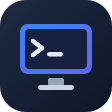

<div align="center">



# tabby-rdp

**Remote desktops in your Tabby SSH tabs.**<br>
Linux (GNOME) and Windows, through the SSH connection you already have.

[](https://www.npmjs.com/package/tabby-rdp)
[](LICENSE)
[](https://tabby.sh)


</div>

---

tabby-rdp is a plugin for the [Tabby](https://tabby.sh) terminal. Press a key in an SSH tab and the machine's desktop
appears in its place; press it again and you're back at the shell. Everything travels inside the SSH connection:
nothing is opened on the network, and nothing has to be installed on the remote machine beforehand.

- **Linux desktops without a monitor or a login.** The plugin starts a headless GNOME session for your SSH user with
  GNOME Remote Desktop, on the fly, without root. A server in a rack works as well as a workstation.
- **Windows desktops** behind any SSH host, such as a VM on your build server.
- **A proper desktop experience:** clipboard and files both ways, sound, live resize to the pane, sharp Retina
  rendering, Mac keyboard shortcuts, and automatic reconnects after sleep.
- **`desk`:** type `desk` in the console and the same shell, with its history and running programs, moves into a
  terminal on the desktop.

The remote desktop itself is [IronRDP](https://github.com/Devolutions/IronRDP)'s web client, running inside Tabby.
Making it work with GNOME took fixes in IronRDP, which we contribute upstream ([below](#built-on-ironrdp)).

## Contents

- [Install](#install)
- [Use](#use)
- [Features](#features)
- [Windows and other desktops behind a host](#windows-and-other-desktops-behind-a-host)
- [desk: the console on the desktop](#desk-the-console-on-the-desktop)
- [Settings](#settings)
- [Requirements](#requirements)
- [Built on IronRDP](#built-on-ironrdp)
- [Development](#development)
- [Limitations](#limitations)
- [License](#license)

## Install

In Tabby: **Settings › Plugins**, search for **tabby-rdp**, install, and restart Tabby.

Or from a terminal, into Tabby's plugin folder (on macOS `~/Library/Application Support/tabby/plugins`, on Linux
`~/.config/tabby/plugins`, on Windows `%APPDATA%\tabby\plugins`):

```sh
npm install tabby-rdp
```

## Use

Open an SSH tab to a Linux machine with GNOME, and:

- press **⌘⇧G** (Ctrl+Shift+G on Windows and Linux), or
- click **Desktop** in the SSH tab's toolbar, or the desktop button in Tabby's header, or
- right-click the terminal or the tab: **Open remote desktop**.

The first connection to a machine takes a few seconds while it prepares GNOME Remote Desktop and a session; later
ones take well under a second. The same shortcut switches between the desktop and the console, and the desktop keeps
running in the background until you disconnect or close the tab.

It also works in a plain local terminal where you typed `ssh host` (macOS and Linux), as long as that host accepts
your key without a password prompt.

One desktop per account: a second tab to the same `user@host` switches to the tab that has it open, rather than
connecting again.

## Features

| | |
|---|---|
| **Clipboard** | Copy and paste text and images in both directions. |
| **Files** | Drop files from Finder onto the desktop, or use **Send files to the remote desktop…**, then paste them in Files or Explorer. Files copied on the remote offer **Save to Downloads**. |
| **Sound** | The remote desktop's sound plays locally. |
| **Resize** | The remote resolution follows the pane as you resize the window or split it. Or reconnect at the new size, or keep a fixed resolution. |
| **Retina** | Optionally renders at device pixels, with the remote's UI scaled to match, for sharp text. |
| **Keyboard on macOS** | ⌘C, ⌘V, ⌘Z and the rest work as on a Mac; tapping ⌘ alone is the Windows key. Tabby's own shortcuts stay out of the way while a desktop is showing, except switching tabs and returning to the console. |
| **Reconnecting** | After sleep or a network change, the desktop reconnects by itself once the connection is back. |
| **Sign-in** | GNOME desktops need none: the plugin manages their credentials. Windows desktops ask for the account once and can remember it in the system keychain. |

<p align="center"></p>

## Windows and other desktops behind a host

An SSH host can lead to other desktops it can reach, such as a Windows VM on the same machine. In that host's menu,
choose **Add a desktop behind \<host\>…** and enter a name, the address as seen from the host, and optionally the
user name. It opens right away, and from then on appears next to the host's own desktop in its menus. **Remote
desktop settings › Remove a desktop** removes one, along with its saved password.

In Tabby's config file, they look like this:

```yaml
remoteDesktop:
  desktops:
    - name: Windows VM
      via: buildhost            # the SSH host: alias, hostname, user@hostname or user@hostname:port
      host: 192.168.122.20      # the RDP server as seen from that host
      port: 3389
      kind: windows             # or gnome
      username: alice           # optional; DOMAIN\user works too
```

The connection runs through the same SSH connection; the Windows machine needs Remote Desktop turned on, and nothing
else.

## desk: the console on the desktop

Type `desk` in an SSH console, and the tab switches to that machine's desktop with a terminal attached to the very same
shell: its scrollback, working directory, jobs and running programs. Type on either side; both show it.

<p align="center">
  
  
</p>

`desk` is off by default, because it makes interactive SSH logins on that machine start inside a shareable session.
Turn it on in **Remote desktop settings**. The sessions are handled by a small helper, `trd-pty`, rather than tmux, so
your terminal's scrollback, colors and shortcuts stay as they are. Turning it off removes it again. Details:
[docs/desk.md](docs/desk.md).

## Settings

Right-click the desktop button in Tabby's header, or open **Remote desktop settings** in a terminal's or tab's menu.
They are stored in Tabby's config under `remoteDesktop`:

| Setting | Default | |
|---|---|---|
| When the pane is resized (`resize`) | Resize the remote desktop to fit (`live`) | Or reconnect at the new size (`reconnect`), or keep the resolution, scaled to fit (`off`). |
| Sharpness (`sharpness`) | Standard (`standard`) | Retina (`retina`): device pixels, with the remote's scale set to match. |
| Sound (`sound`) | On | Applies on the next connection. |
| Mac shortcuts (`macShortcuts`) | On | macOS. Off: ⌘ is the Windows key. |
| Bring the console along with `desk` (`desk`) | Off | Installs `desk` and a login line on each machine you open a desktop on; applies on the next connection there. |
| Session backend (`sessionBackend`) | `native` | For `desk`: `native` (trd-pty) or `tmux`. Config file only. |

## Requirements

- **Tabby 1.0.236 or newer**, on macOS or Windows (tested with 1.0.236 and 1.0.237). Tabby on Linux hasn't been
  tested yet. On a fresh Windows, Tabby itself needs the
  [Microsoft Visual C++ Redistributable](https://learn.microsoft.com/cpp/windows/latest-supported-vc-redist) for SSH.
- **Linux desktops:** GNOME Shell and GNOME Remote Desktop 46 or newer (Ubuntu 24.04, for example), a systemd user
  session, and SSH access with a key or agent. `desk` also needs `python3` and GNOME Terminal. No root, no display, no
  login screen.
- **Windows desktops:** Windows 10 or 11 Pro, or Windows Server, with Remote Desktop turned on, reachable from an SSH
  host.

Tested with Ubuntu 24.04 (GNOME Remote Desktop 46.3) and Windows 11 (Pro and Enterprise), from Tabby on macOS and on
Windows 11.

## Built on IronRDP

The desktop is [IronRDP](https://github.com/Devolutions/IronRDP)'s web client: an RDP implementation in Rust, compiled
to WebAssembly, with a web component. It connects to Windows, but a browser-based client for GNOME Remote Desktop
needed more: GNOME only speaks RDP's graphics pipeline, which IronRDP's web client didn't offer; it resizes its
monitor in a way the web client didn't follow; and it depends on details of the sound and dynamic-channel protocols
that IronRDP got slightly wrong. The web client also had no sound at all.

tabby-rdp ships IronRDP with a short series of patches ([ironrdp/](ironrdp)). The fixes go upstream, one by one:

| Change | Upstream |
|---|---|
| Keep the session when a server sends data on a channel the client declined | [Devolutions/IronRDP#2005](https://github.com/Devolutions/IronRDP/pull/2005) |
| Fit the web component to its container, not the whole window | [Devolutions/IronRDP#2006](https://github.com/Devolutions/IronRDP/pull/2006) |
| Set up the clipboard before signaling `ready`, so it works for apps that connect right away | [Devolutions/IronRDP#2018](https://github.com/Devolutions/IronRDP/pull/2018) |
| Echo the correct size in the sound channel's Training Confirm | [Devolutions/IronRDP#2019](https://github.com/Devolutions/IronRDP/pull/2019) |
| The graphics pipeline in the web client, per connection, following its resets | Planned |
| Sound in the web client | Planned |

The aim is to make IronRDP's browser client work well with both Linux and Windows desktops, for everyone who embeds
it, not just this plugin.

## Development

```sh
npm install
npm run build                # TypeScript to dist/
scripts/sandbox.sh           # a separate Tabby with this plugin linked in (macOS), DevTools on port 9334
npm test                     # end-to-end suites against a test machine: see test/README.md
npm run build:ironrdp        # rebuild vendor/ from IronRDP and ironrdp/patches: see ironrdp/README.md
```

- [docs/architecture.md](docs/architecture.md): how the pieces fit, the remote setup, and security notes.
- [docs/desk.md](docs/desk.md): `desk` and trd-pty.
- [test/README.md](test/README.md) and [testbed/README.md](testbed/README.md): the tests, and setting up test
  machines for them.
- [CONTRIBUTING.md](CONTRIBUTING.md).

## Limitations

- **One client per account on GNOME.** A second client (another machine, or another Tabby window) gets an extra,
  empty monitor instead of the same screen, which is how GNOME Remote Desktop's headless mode works.
- **The headless GNOME session is a shell without `gnome-session`:** apps work (Settings, Files, Terminal, Firefox), but
  GNOME's background settings daemons don't run, and X11-only apps don't start.
- **GNOME's login-screen mode** isn't supported: it hands clients over with a server redirection, which IronRDP can't
  follow yet. The plugin uses per-user headless sessions instead.
- **GNOME Remote Desktop listens on all interfaces** (password-protected, TLS); it has no setting to listen on
  loopback only. See [docs/architecture.md](docs/architecture.md#security-notes) to restrict it.
- **Windows-key combinations** such as Win+R don't come through from macOS. Tapping ⌘ for the Windows key does.
- **Desktops behind a host** can be added and removed from the menus, but not edited there.

## License

[MIT](LICENSE). The bundled IronRDP build is MIT or Apache-2.0 ([vendor/IRONRDP-LICENSE](vendor/IRONRDP-LICENSE)).
Icons in the header are from [Font Awesome Free](https://fontawesome.com) (CC BY 4.0).

tabby-rdp is an independent project, not affiliated with Tabby, Devolutions or the GNOME Project.
